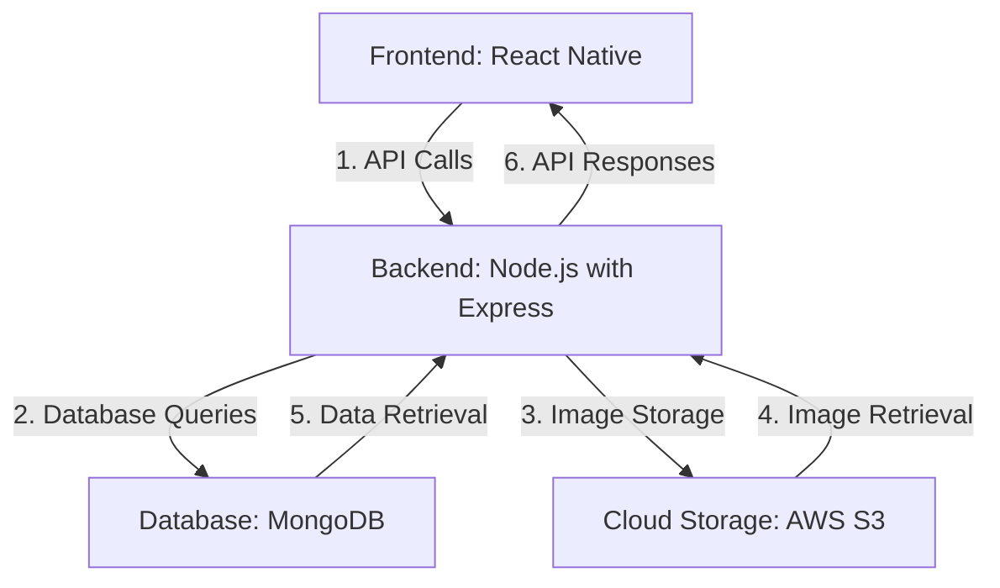
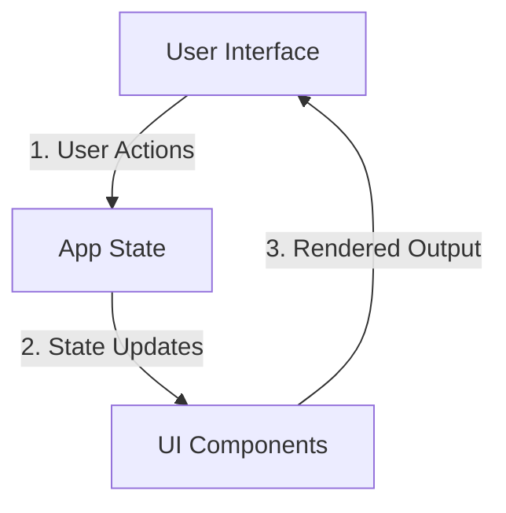
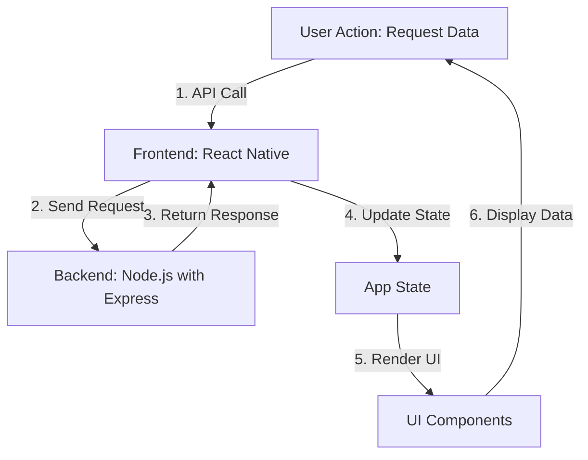
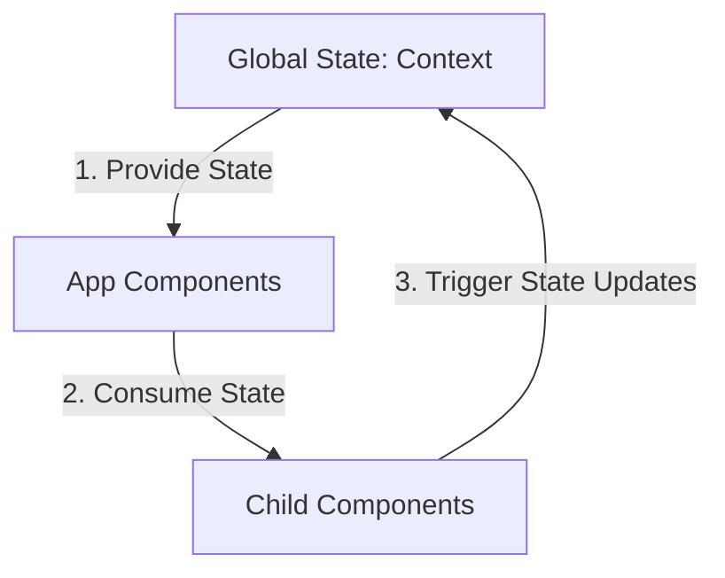
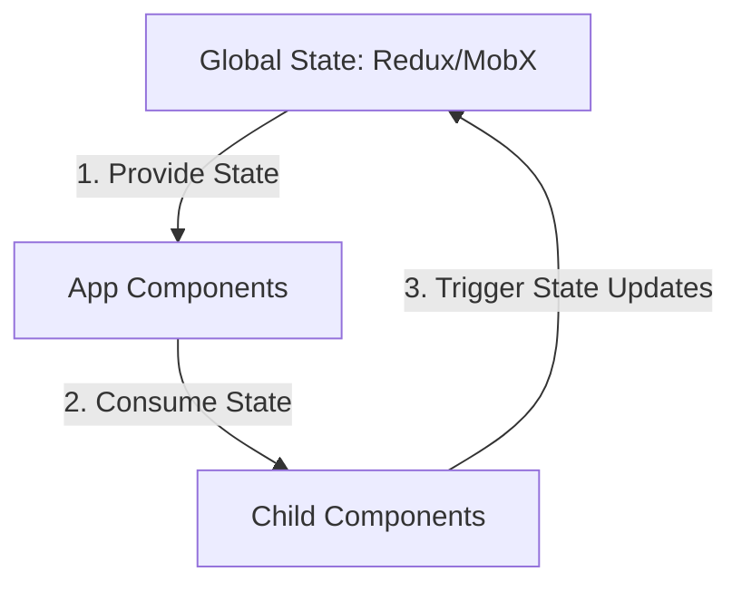
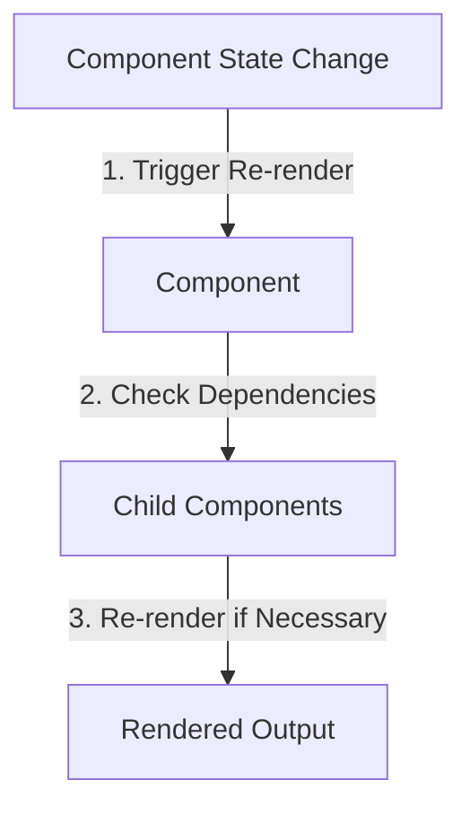
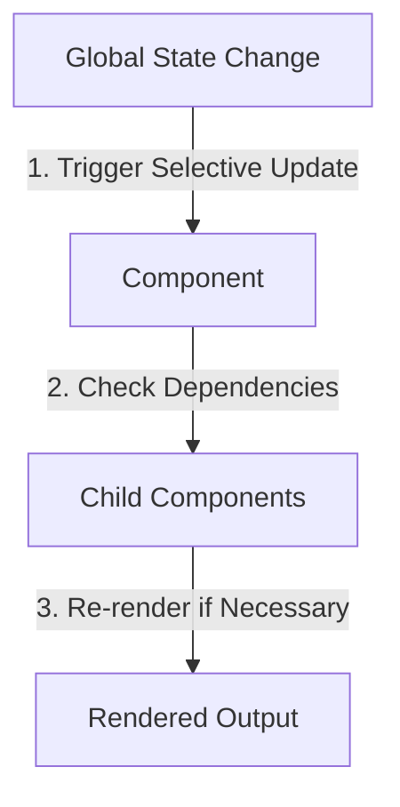
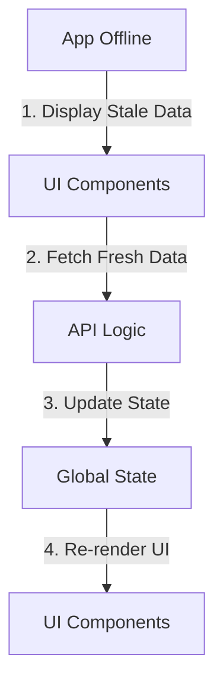

# Project Reevaluation

## A. Introduction

This document reevaluates the current status of the project, identifies areas for improvement. The goal is to suggest a better approach to achieve the desired outcomes and ensure the project meets its objectives effectively.

## B. Working Plan

### 1. Group status

There are 2 members that are actively working on the project (out of 3 total members). The current work division is to have each team member focus on their features of the app. Me (Duy) will try to connect everything together and make sure the app is working properly.

**Problem:**

- For a serious project, this approach is not effective. As each person works on their own features, it leads to a nightmare in integration and testing. 

- The architecture, foundation, and design of the app are not well thought out. This leads to a lot of time wasted on fixing issues that could have been avoided with better planning.

- The response loop for architecture and design decisions is not effective due to the high load of work on project manager. 

### 2. Proposed solution

The work should be divided into 2 main parts:

1. **Part 1: Architecture and Design (Duy)**

    - Focus on the architecture and design of the app
    - Orchestrate the work of the team members to ensure that the app is built on a solid foundation
    - Determine and build the foundation of the app, including the architecture, design patterns, and best practices
    - Handle the integration of the work done by other teammates
    - Responsible for the overall quality and performance of the app (testing, debugging, and optimization)

2. **Part 2: Implementation and Testing (team member)**

    - Handle assigned implementation tasks, such as building specific features or components of the app
    - Responsible for testing and debugging their own work, as well as collaborating with the project manager to ensure that their work integrates seamlessly with the rest of the app
    - Suggest improvements or optimizations to the architecture and design of the app based on their experience and expertise

## C.Architecture and Design

### 1. Introduction

The project is to build a mobile application that allows users to track their progress in bouldering. The app will allow users to upload images of boulder problems, track their attempts and successful completions, set goals for improvement, and view a history of all boulder problems attempted.

### 2. Architecture

1. **Primitive approach:** React Native for cross-platform mobile development, Node.js with Express for API development, MongoDB for storing user data, boulder problems, images, and progress tracking, and AWS S3 for storing images of boulder problems.



2. **Frontend**: Handle user interactions, display data, and manage the app's state. It will communicate with the backend through API calls to fetch and send data.

Simple state management can be explained as follows:



Deeper dive into a GET request flow from the frontend perspective:



States are passed down to child components as props, and child components can trigger state updates through callbacks. This approach introduces a problem as the app grows in complexity. For instance, only child 3 needs props A to update, but it has to go through child 1 and child 2, which can lead to unnecessary re-renders and performance issues. Also, maintaining the state can become cumbersome. This problem is known as **Prop Drilling**.

**Solution to Prop Drilling**: 

- Use React's createContext and useContext to create a global state that can be accessed by any component in the app. 



- Use a global state management library. Under the hood, these libraries use a similar approach to React's context API, but they provide additional features and optimizations for managing state in larger applications.



For scalability, the app should be designed with a modular architecture, where each feature is encapsulated in its own module. A global state management solution should be implemented to manage the app's state and ensure that data is consistent across all components.

The decided solution to this problem is to use **Zustand**, a small, fast, and scalable state management solution for React. For a medium size application, Zustand is a good choice as it provides a simple and intuitive API for managing state, while also being lightweight and performant. It allows for easy state sharing between components without the need for prop drilling or complex state management libraries.

The next problem with state managing in React is that when a component's state changes, it triggers a re-render of the component and all its child components. This can lead to performance issues, especially in larger applications with many components. 

**Solution to Performance Issues**:

- Use React's memoization techniques, such as React.memo and useMemo, to prevent unnecessary re-renders of components that do not depend on the changed state. 



- Use a global state management solution that allows for selective updates of components based on the specific state changes they depend on. This can help to minimize unnecessary re-renders and improve performance.



**UI and API logic**: The UI and API logic should be separated to ensure that the app is maintainable and scalable. The UI should be responsible for rendering the components and handling user interactions, while the API logic should handle data fetching, state management, and business logic.

Split the folder structure into two main parts: `ui` and `api`. The `ui` folder will contain all the components, screens, and styles for the app, while the `api` folder will contain all the logic for fetching data from the backend, managing state, and handling business logic.

```plaintext
project-root/
├── ui/
│   ├── components/
│   ├── screens/
│   └── styles/
└── api/
    ├── controllers/
    ├── models/
    └── routes/
```

**Stale data and Offline Synchronization**: This is the final problem that needs to be addressed. When the app is offline, it should still be able to function and allow users to interact with the app. When the app comes back online, it should synchronize the data with the backend and update the UI accordingly.

A solution to this is to implement Stale-While-Revalidate (SWR) or **TanStack Query**, which are libraries that provide caching and synchronization capabilities for data fetching in React applications. These libraries allow the app to display stale data while fetching fresh data in the background, ensuring that the user always has access to the most up-to-date information.



**Development productivity tools**:

*React Native DevTools*: Breakpoints and React Tree

*Reactotron*: Zustand and Network monitor

*ESLint*: Code quality and formatting

*Expo Dev Plugins*: For debugging and testing React Native apps

*Sentry SDK*: For error tracking and monitoring

**Implemented stacks and techs**

| Area | Stack / Tech | Purpose |
|------|--------------|---------|
| Frontend | React Native | Cross-platform mobile app development |
| Frontend | Zustand | Global state management without prop drilling |
| Frontend | React.memo | Prevent unnecessary re-renders |
| Frontend | useMemo | Memoize expensive values |
| Frontend | createContext / useContext | Shared state access when needed |
| Frontend | TanStack Query or SWR | Cache, stale data handling, and offline synchronization |
| Frontend | React Native Testing Library | UI testing |
| Frontend | React Native DevTools | Debugging and React tree inspection |
| Frontend | Reactotron | Zustand and network monitoring |
| Frontend | ESLint | Code quality and formatting |
| Frontend | Expo Dev Plugins | Debugging and testing support |
| Frontend | Sentry SDK | Error tracking and monitoring |
| Backend | Node.js | Backend runtime |
| Backend | Express | API development |
| Backend | MongoDB | Document database from the original architecture plan |
| Backend | PostgreSQL | Relational database |
| Backend | Prisma | ORM for type-safe database access |
| Backend | Zod | Request/data validation |
| Backend | Prisma Studio | Database schema and data visualization |
| Backend | Postman | API endpoint testing |
| Backend | Vitest | Backend API testing |
| Storage | AWS S3 | Image storage |

The table above consolidates the stacks and technologies described in the reevaluation into one place for quick reference.

**Summary**: The table below summarizes the problems and solutions discussed above.

| Problem | Solution | Reasoning |
|---------|---------|---------|
| Prop Drilling | Zustand | To avoid passing props down multiple levels |
| Performance Issues | React.memo, useMemo, Zustand | To prevent unnecessary re-renders and improve performance |
| Stale Data and Offline Synchronization | TanStack Query | To allow the app to function offline and synchronize data when back online |
| UI and API logic separation | Split folder structure into `ui` and `api` | To ensure maintainability and scalability of the app |
| Development productivity tools | React Native DevTools, Reactotron, ESLint, Expo Dev Plugins, Sentry SDK | To improve the development experience and code quality |

3. Backend

A standard approach to backend is implemented with Node.js with Express for API development, postgreSQL for storing user data, boulder problems, images, and progress tracking, and AWS S3 for storing images of boulder problems. The backend will handle data fetching, state management, and business logic.

We also need Prisma as an ORM to interact with the database. Prisma provides a type-safe and efficient way to query the database, making it easier to work with data in the backend.

**Essential techs**:

- Zod: For validating the data sent to the backend, ensuring that the data is in the correct format and meets the required criteria.

- Prisma studio: For visualizing the database schema and data, making it easier to understand the structure of the database and the relationships between different entities.

- Postman: For testing the API endpoints and ensuring that they are working correctly. Postman allows for easy testing of different request types and parameters, making it easier to debug and troubleshoot issues with the backend.


4. Testing

**Frontend**: Use React Native Testing Library to test the UI components and ensure that they are rendering correctly and handling user interactions as expected.


**Backend**: Use Vitest to test the API endpoints and ensure that they are returning the correct data and handling errors appropriately. Vitest provides a simple and efficient way to write unit tests for the backend, making it easier to catch bugs and ensure that the backend is functioning correctly.